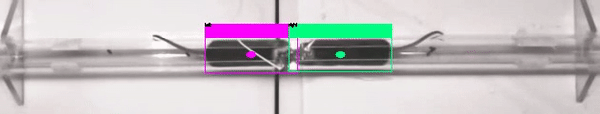

# Mice Object Detection
Relevant code to project in mice object detection and realtime processing. 
[\[Demo\]](https://drive.google.com/file/d/1YMWc5DYaNvzqUyyXHwcPABQWwh78or5j/view?usp=sharing) 
[\[Slides\]](https://docs.google.com/presentation/d/1SUGunykGN7G1IXJcG5yjy_yqWOMqjYtznB83klRZLOE/edit?usp=sharing)

This project helped aid the experiments in the [\[paper\]](https://pubmed.ncbi.nlm.nih.gov/31230711/)
> Correlated Neural Activity and Encoding of Behavior across Brains of Socially Interacting Animals.
> Lyle Kingsbury , Shan Huang, Jun Wang, ***Ken Gu***, Peyman Golshani, Ye Emily Wu, Weizhe Hong.
> Cell 2019

[](https://drive.google.com/file/d/1YMWc5DYaNvzqUyyXHwcPABQWwh78or5j/view?usp=sharing)

[](https://drive.google.com/file/d/1X-TJBHkxDh9lJsY3UjbBEPu-C-jJ6L1W/view?usp=sharing)
This mice are given neural signals and we want to track how they react through their position within the video.
## Tabel of Contents

1. [Overview](#overview)
2. [Data Annotation](#data-annotation)
3. [DarkNet Configuration](#darknet-configuration)
4. [Training](#training)
5. [Results](#viewing-results)
6. [Changing Source Code](#changing-source-code)
7. [Analysis of Video Files](#analysis-of-video-files)
8. [Real Time Detection with Camera](#real-time-processing)


## Overview
We will be training images with a [YOLOV2](https://pjreddie.com/darknet/yolo/) implementation called [darknet](https://github.com/AlexeyAB/darknet) for windows.

This supports:
* both OpenCV 2.x.x and OpenCV <= 3.4.0 (3.4.1 and higher isn't supported)
* both cuDNN v5-v7
* CUDA >= 7.5

To create our own traning set we will be using [BBox-Label-Tool](https://github.com/puzzledqs/BBox-Label-Tool)
This requires:
* python 2.7
* python PIL (Pillow)

Training images and video is from Professor Weizhou

## Data Annotation
To annotate we need to:
* place our training images in `yolo_processing\BBox-Label-Tool\Images\[Numbered Folder ie. 001, 002, etc]`
* open Bbox-Label-Tool by running `main.py` in the BBox-label-Tool directory

Labels will be in `python scripts\BBox-Label-Tool\Labels` with the same numbered directory as the images in .txt files with the resulting format:
```
[category number]
[bounding box left X] [bounding box top Y] [bounding box right X] [bounding box bottom Y]
...
```

Note, the BBox-Label-Tool requires images to be .jpeg files but that can be adjusted to .jpg by changing the code in main.py

### Convert to YOLOv2 Format

YOLOv2 takes labels of the form 
```
[category number] [object center in X] [object center in Y] [object width in X] [object width in Y]
```
To fix this there is a script in `python scripts\convert_to_yolo.py` which converts to the YOLO format. Change the paths `mypath` and `outpath` in `convert_to_yolo_.py`

### Other files
`change_classes.py` was used to change from two classes to one class.
`rename_same.py` adds an extension to the file name for same file names.
`rename.py` if ever files of the form cvrt-wM-06305.png.txt converts them to cvrt-wM-06305.txt

## Darknet Configuration 
Darknet needs you to tell it what images are going to be the test set and training set. To do this there `process.py` which takes images and splits up into a test and train set written to test.txt and train.txt which is used by darknet. Furthermore, `process.py` is to be run in the same folder as the images. 

Next Darknet needs specific configuration files.  Three files needs to be created. 
* `obj.data` in `\darknet\build\darknet\x64\data\cfg`which takes the following format
  
  ```
   classes = [num classes]
   train = train.txt (from earlier)
   valid = test.txt (from earlier)
   names = obj.names 
   backup = /backup
   ```
   Note train.txt and test.txt are stored in `\darknet\build\darknet\x64\` and backup is where the backup weights are stored 
* `obj.names` in `\darknet\build\darknet\x64\`should simply be the following where each new category is on a newline
  ```
  mice
  ```
* `obj.cfg` in `\darknet\build\darknet\x64\cfg` which should look similar to the `yolo2.0.cfg` except with the following changes
  * line 2 `batch=32` this is what works best on my Nvidia GTX 1050 GPU without the traning being stopped due to CUDA being out of memory
  * line 3 `subdivisions=8` in which the batch will be divided by to decrease GPU and VRAM requirements. The higher the number the less load on the GPU
  * line 230 `classes=[Num Classes]` the number of classes to classify
  * line 224 `filters = (Classes + 5) *5` the number of filters in the last convolutional layer
  
 ## Training
 To train, run the following command in cmd
 ```
 darknet.exe detector train data/cfg/obj.data cfg/yolo-obj.cfg darknet19_448.conv.23
 ```
 Note, the 
 
 The line 
 `2: 2.950644, 15.939886 avg, 0.001000 rate, 2.813000 seconds, 128 images` 
 shows the training step followed by the error. Previously I had trained for 2.5 hours in which the error was around 0.06.
 Weights are stored in `/backup` at every 100 iterations.
 
 To continue training from the last saved weights file:
 ```
 darknet.exe detector train data/obj.data cfg/yolo-obj.cfg yolo-obj_2000.weights
 ```
 
 ## Viewing Results
 
 
 We use the .weights file to run our model on new images. 
 To run on a test image:
 ```
 darknet.exe detector test data/obj.data cfg/yolo-obj.cfg backup/yolo-obj_1600.weights [PATH to image]
 ```
 To view on a AVI file:
 ```
 darknet.exe detector demo data/obj.data cfg/yolo-obj.cfg backup/yolo-obj_1600.weights data/weizhe_videos/MouseA06_20140814_14-25-44_Top_J85.avi
```
With my GPU I get around 20-21 frames per second. 

To run and save a AVI file:
```
darknet.exe detector demo data/obj.data obj/yolo-obj.cfg backup/yolo-obj_1600.weights [Path to AVI] -i 0 -out_filename [Result Filename]
```

 ## Changing Source Code
 To use the output of the network for postprocessing and analysis we can print the bounding box locations to stdout and using another 
 python script to process that in any way necessary. 
 To change the source code open darknet.sln in `/darknet/build/darknet/`. `image.c` contains drawing the borders in the `draw_detections_cv` function which is used in `demo.c`. For YOLOv3 this is `draw_detections_cv_v3`. I have changed the source code to add a midpoint of the bounding box. For YOLOv2 I was able to get the frame number in `demo.c`.
 ```
double frame_num = cvGetCaptureProperty(cap, CV_CAP_PROP_POS_FRAMES);
int frames = (int)frame_num; 
 ```
 However for this new version, it does not seem to work. 
 
 ## Analysis of Video Files 
 To analyze the locations of mice, I first direct the stdout (containing detections of mice) of the YOLO network to a file.
```
darknet.exe detector demo cfg/obj_pipe_one_class.data cfg/yolo-pipe_one_class.cfg backup_pipe1/yolo-pipe_one_class_2200.weights 
data/weizhe_videos/april/LK96_TTexp3_full_behavCam.avi -i 0 -out_filename results/result1_LK96_TTexp3_full_behavCam.avi > results/result1_LK96_TTexp3_full_behavCam.txt -thresh 0.5
``` 
The output in this example is stored in `results/result1_LK96_TTexp3_full_behavCam.txt` containing data of all frames and where each frame is of the form:

```
Objects:
frame_num: 5 
left: 87%
top x: 257 
top y: 62 
midpoint x: 190 
midpoint y: 83 
left: 85%
top x: 528 
top y: 64 
midpoint x: 458 
midpoint y: 83 
```
where the numbers are pixel coordinates and the percentage can be thought of as the confidence in the detection. 
The path of `results/result1_LK96_TTexp3_full_behavCam.txt` is then passed to the jupyter notebook `yolo_processing/notebooks/convert_yoloy_rawout_to_csv.py.ipynb` converting the output to a csv. Samples are included in `samples`.

## Real Time Processing 
The goal of this part of the project is to use the output of the yolo detection in realtime and give commands to external hardware to affect the  experiment.
The current implementation of realtime processing is using a python subprocess to run the yolo network and take the subprocess's stderr output and further process it before serially writing to an arduino. The code is in `realtime_processing\serial_connect.py`. 
